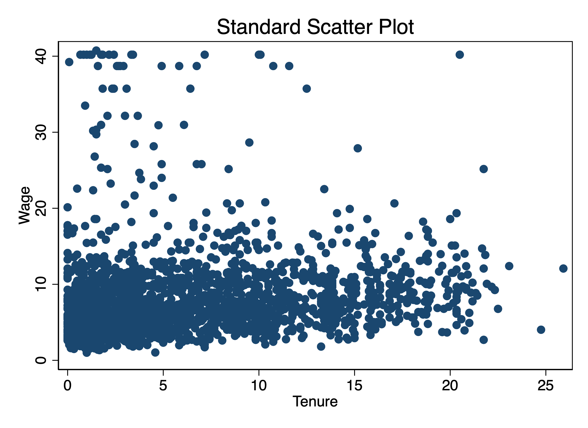
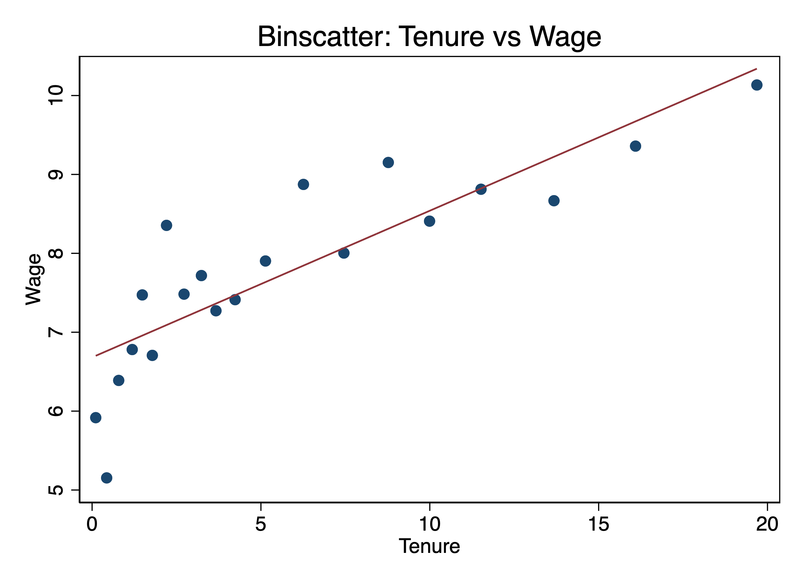
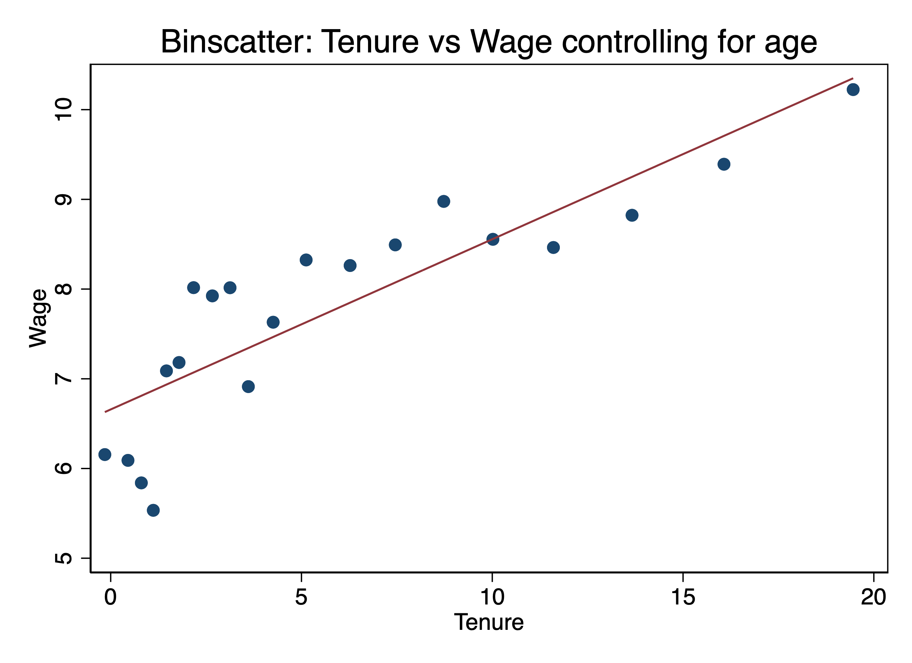
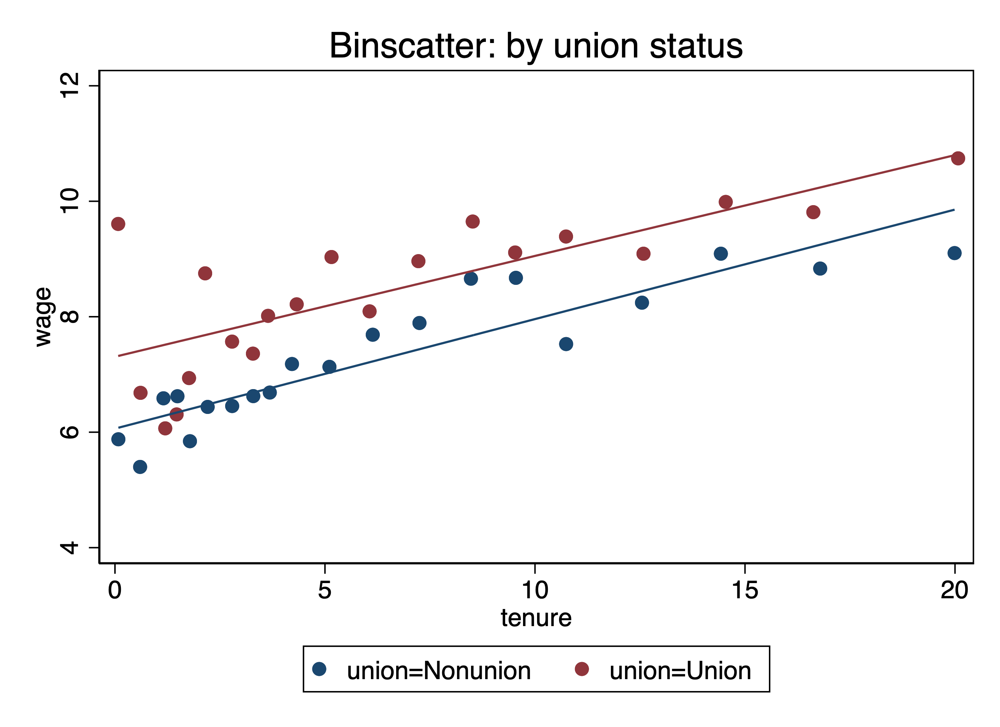
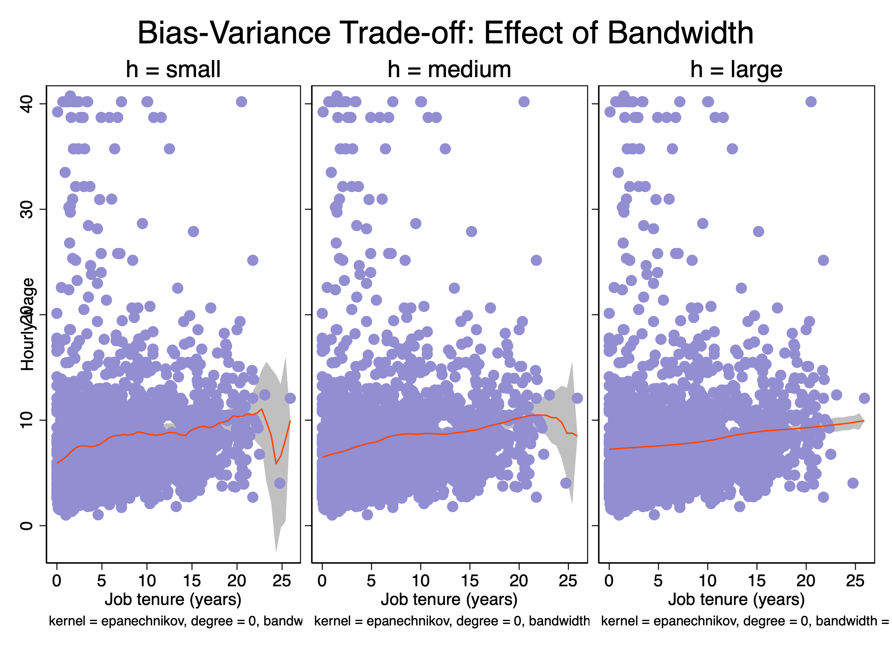
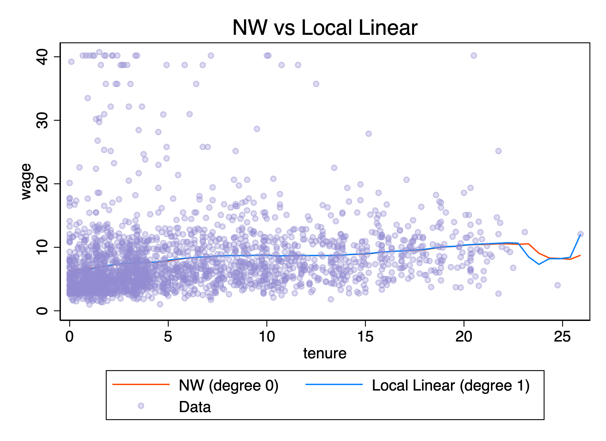
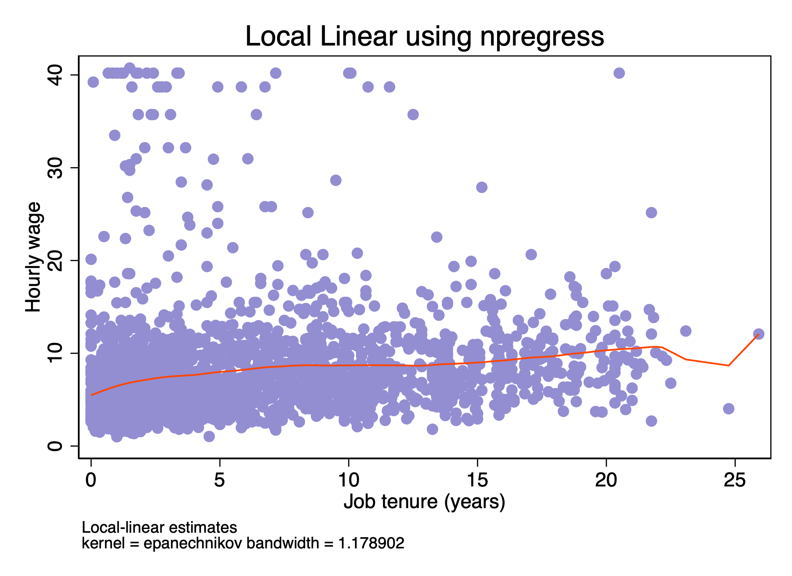
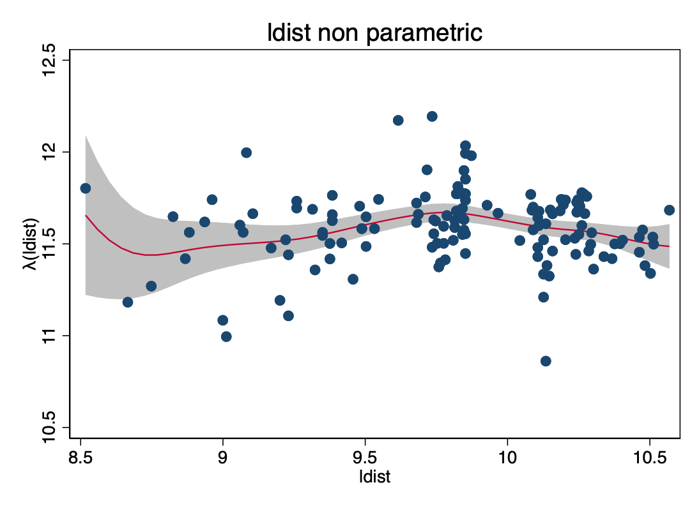

---
format:
  revealjs:
    title-slide: false
---

<section class="title-slide-custom">
<div class="title-main">Causal Inference & ML</div>
<div class="title-ta">TA Session 2</div>
<div class="title-program">Data Science for Decision Making</div>
<div class="title-author">Lucia Sauer</div>
<div class="title-date">2026-02-13</div>
</section>


# Outline

:::incremental
- Non Linear Models
- Histograms + KDE
- Binned scatter plots
- Local Linear regression
- Robinson’s difference estimator
:::


# Non Linear Models

# The Data

- **Dataset:** CRIME4 (Wooldridge)
- **Panel structure:** 90 counties, T=7 years (1981-1987)

- **Outcome variable:** Binary indicator for high crime rate

$$\text{high_crime}_{it} = \begin{cases} 1 & \text{if crime rate} > 0.04 \\ 0 & \text{otherwise} \end{cases}$$


- **Key regressors:** 
  - `lprbarr`: log probability of arrest
  - `lprbconv`: log probability of conviction
  - `lpolpc`: log police per capita
  - `ldensity`: log population density
  - `lwcon`: log construction wage

<span style="color:#1f3a93; font-weight:600;">Research question</span>: What determines whether a county experiences high crime?


## Linear Probability Model with FE

<span style="color:#1f3a93; font-weight:600;">Question</span>: How would you estimate a LPM with county fixed effects?

**Model:**
$$\text{high_crime}_{it} = \alpha_i + X_{it}'\beta  + \varepsilon_{it}$$

where:

- $\alpha_i$ = county fixed effect
- $\beta$ = **marginal effects** (direct interpretation)

**Within transformation get rid off $\alpha_i$:**

1. Demeaning and get rid off $\alpha_i$
$$
\text{high_crime}_{it} - \bar{\text{high_crime}}_{i}
= (X_{it} - \bar X_i)'\beta + (\varepsilon_{it} - \bar \varepsilon_i)
$$
2. Run FE regression over this transformed model
$$
\tilde{\text{high_crime}}_{it}
= \tilde X_{it}'\beta + \tilde \varepsilon_{it}
$$

```stata
xtreg high_crime lprbarr lprbconv lpolpc ldensity lwcon, fe vce(cluster county)
```

## LPM: The Problem
:::incremental

1. Predictions outside the [0,1] range  

   $$
   \hat P(\text{high\_crime}=1) > 1 \quad (25 \text{ observations})
   $$

   $$
   \hat P(\text{high\_crime}=1) < 0 \quad (180 \text{ observations})
   $$

2. Heteroskedasticity (by construction)  

   $$
   \text{Var}(\varepsilon_{it} \mid X_{it}) = P_{it}(1 - P_{it})
   $$

   Depends on $X_{it}$

3. Constant marginal effects (unrealistic)  

   A 1% increase in arrest probability reduces high crime by **9.8 percentage points**  
   for all counties, regardless of whether the baseline probability is 5% or 80%.

4. Imposed linearity

:::


## Nonlinear Model: Logit with FE

**Model specification:**

$$P(\text{high_crime} = 1 \mid X_{it}, \alpha_i) = \Lambda(X_{it}'\beta + \alpha_i)$$

where $\Lambda(z) = \frac{\exp(z)}{1 + \exp(z)}$ is the **logistic CDF**

$$
P(\text{high_crime}_{it}=1 \mid X_{it},\alpha_i)
= \frac{\exp(\alpha_i + X_{it}'\beta)}{1+\exp(\alpha_i + X_{it}'\beta)}
$$

- Probabilities are **guaranteed** to be in [0,1], 
- Better fit for binary outcomes
- Non-constant marginal effects

::: {.box-blue}
<div class="box-title">The IPP problem</div>

But estimating $\beta$ and 90 $\alpha_i$ with only $T=7$ obsertavations creates the **Incidental Parameters Problem**

- As $N \to \infty$ but $T$ fixed $\Rightarrow$ $\hat{\beta}$ is **inconsistent**
- Bias $= O(1/T) \approx 14\%$

:::


## Solution: Sufficient Statistic

For the logit model, 

$$S_i = \sum_{t=1}^T \text{high_crime}_{it}$$ 

is a **sufficient statistic** for $\alpha_i$

**Definition:** $S_i$ is sufficient for $\alpha_i$ if:

$$P(\text{high_crime}_{i1},...,\text{high_crime}_{iT} \mid S_i, X_i, \beta) \text{ does not depend on } \alpha_i$$

**What this means:**

Instead of maximizing:
$$L(\beta, \alpha_1,...,\alpha_N \mid y, x)$$

Maximize the conditional likelihood:
$$L_c(\beta \mid y, x, S_1,...,S_N) = \prod_{i=1}^N P(y_i \mid S_i, x_i, \beta)$$

**Result:** 

- $\alpha_i$ **disappears** from the likelihood
- Estimate $\beta$ **without** estimating $\alpha_i$
- $\hat{\beta}$ is **consistent** even with small T

**Cost:** Only counties with $0 < S_i < 7$ contribute (14 of 90)


## Conditional Logit

In stata conditional Logit is implemented using `xtlogit` and `or` to interpret the coefficients as odds ratios (ORs):

```stata
xtlogit high_crime lprbarr lprbconv lpolpc ldensity lwcon, fe or
```

**Results** (N=98, 14 counties):

| Variable | Odds Ratio | Interpretation |
|----------|-----------|----------------|
| lprbarr  | 0.0002*** | ↓ Reduces odds 99.98% |
| lprbconv | 0.0002*** |  ↓ Reduces odds 99.98% |
| lpolpc   | 13,067*** |  ↑ Increases odds (!) |
| ldensity | 5,369     |  Not significant |
| lwcon    | 0.432     |  Not significant |

**Key findings:**

- **Strong deterrence:** Higher arrest/conviction probability dramatically reduces crime odds
- **Police puzzle:** Positive coefficient likely reflects **reverse causality** (crime → hire police)
- **Sample note:** Only 14 "switcher" counties used (76 dropped due to no variation)


<span style="color:#1f3a93; font-weight:600;">Interpretation</span>: OR $<$ 1 decreases odds, OR $>$ 1 increases odds.

<!-- new_odds = original odss * OR
= 100*0.0003 = 0.02
the odds reduce from 100 to 0.02, so the odds are reduced by 99.98% -->

# Nonparametric Density Estimation

## Histograms

A nonparametric method to estimate the probability density function (PDF)

$$\hat f(x_0)
= \frac{1}{Nh}\sum_{i=1}^N \frac{1}{2}\,
\mathbf 1\!\left(\left|\frac{x_i - x_0}{h}\right| < 1\right)$$

**Idea:** Count observations in bins, normalize by sample size and bin width

The degree of smoothing of the histogram can be controlled by selecting:

1. Number of bins
```stata
histogram price, bin(10)  name(hist10, replace)
```
1. Bin width $2h$
```stata
histogram price, width(2000) density name(hist_wide, replace)
```

## Kernel Density

Smooth, nonparametric estimate of the probability density function

$$\hat f(x_0)
= \frac{1}{Nh}\sum_{i=1}^N \,
K \!\left(\frac{x_i - x_0}{h}\right)$$


- Role of $K(\cdot)$: weighting function that determines how much each observation $x_i$ contributes to the density estimate at the point $x_0$
- Role of $h$: smoothing parameter that controls the width of the kernel.


::: {.box-blue}
<div class="box-title">**How to choose optimal h?**</div>

- The one that minimizes MISE, but since we do not know $f$ that is the true density function, we can assume that it follows a Normal distribution $f \approx N(\mu, \sigma^2)$.
- Silverman's Plug-in Solution is the one used by default in Stata. 

$$\hat{h}^* = 1.364 \times \delta \times \min\left(s, \frac{IQR}{1.34}\right) \times N^{-1/5}$$

For Epanechnikov kernel: 

$$\hat{h}^* = 0.9 \times \min\left(s, \frac{IQR}{1.34}\right) \times N^{-1/5}$$
:::

<!-- Note: The histogram is a special case of the kernel density estimator where the kernel is the uniform (rectangular) density.  -->

# Non Parametric Regression

## Binned Scatter plots
With large N, scatter plots become unreadable, and can't see conditional means:

**Binscatter Steps:**

1. Divide tenure into 20 bins
2. Calculate mean of wage within each bin
3. Plot (mean tenure, mean wage) for each bin

```stata
scatter wage tenure
binscatter wage tenure, nq(20)
```

::: {.columns}
::: {.column width="50%"}
<div style="text-align: center;">
  
</div>

:::

::: {.column width="50%"}
<div style="text-align: center;">
  
</div>
:::
:::


## Controlling for Covariates

**Frisch-Waugh-Lovell (FWL) Theorem:**

Residualize both Y and X with respect to controls:

1. Regress wage on controls $\rightarrow$ get residuals $\tilde{wage}$
2. Regress tenure on controls $\rightarrow$ get residuals $\tilde{tenure}$
3. Binscatter: plot $\tilde{wage}$ vs $\tilde{tenure}$

**In Stata:**
```stata
binscatter wage tenure, controls(age)
```

<div style="text-align: center;">
  
</div>

**Assumption:** Linearity in controls  
**Violation:** If controls enter nonlinearly → misleading plot

---

## Binscatter by Groups

**Compare relationships across subgroups:**
```stata
binscatter wage tenure, nq(20) by(union)
```

<div style="text-align: center;">
  
</div>


Shows $E(wage|tenure)$ separately for union, useful for heterogeneity analysis.


## Cattaneo et al. (2024)

**Traditional binscatter issues:**

1. Assummes linear CEF
1. **Bin choice matters** (10 vs 20 vs 50 bins)
2. **No formal inference** (confidence intervals)


**`binsreg` improvements:**

1. Employs semi-parametric methods to visualize CEF
2. **Data-driven bin selection** (optimal number of bins)
3. **Confidence intervals** (pointwise or uniform bands)

# Nonparametric Regression

## Kernel regression: Nadaraya-Watson Estimator

- Instead of using a rectangular kernell as with `binscatter`, now we could adapt the kernell function to make smooth the approximation to the CEF:


$$\hat{m}_{NW}(x_0) = \frac{\sum_{i=1}^N K\left(\frac{x_i - x_0}{h}\right) y_i}{\sum_{i=1}^N K\left(\frac{x_i - x_0}{h}\right)}$$

- Points closer to $x_0$ get more weight
- Can be interpreted as weighted local average

Equivalent to:

$$\min_{\beta_0}\sum (y_i-\beta_0)^2K\!\left(\frac{x_i-x_0}{h}\right)$$

## Bandwidth and Bias--Variance Tradeoff

- As we discussed, the election of $h$ is which control the variance bias trade off.  

<div style="text-align: center;">
  
</div>

## Choosing optimal $h$: 

**Leave-One-Out Cross Validation**: choose $h$ such that it minimized the MISE out of sample.

$$\text{Toy data:} \quad (x,y)=\{(1,2),(2,3),(3,2),(4,5)\}$$

1. Step 1: Try bandwidth $h$.

2. Step 2: remove $(1,2)$  

  Estimate $\hat{m_{-1,h}}(1)$ using remaining three points.

2. Step 3: prediction error:

  $$(2-\hat{m_{-1,h}}(1))^2$$

  Repeat for all points:

  $$CV(h)=\frac{1}{4}\sum_{i=1}^4 (y_i-\hat{m_{-i,h}}(x_i))^2$$

Choose $h$ minimizing $CV(h)$.

**In practice:** `lpoly` uses plug-in bandwidth approximating this optimum.


## Local Linear Regression

Instead of approximating the function close to $x_0$ with a constant, now we can approximate it with a line.

For each $x_0$ solves:

$$\min_{\beta_0,\beta_1}\sum (y_i-\beta_0-\beta_1(x_i-x_0))^2K\!\left(\frac{x_i-x_0}{h}\right)$$

$$\hat{m(x_0)}=\hat{\beta_0}, \qquad \hat{m'(x_0)}=\hat{\beta_1}$$


<div style="text-align: center;">
  
</div>


## npregress and Marginal Effects

```stata
npregress kernel wage tenure
npgraph, title("Local Linear using npregress")
```
1. Allows multiple covariates
2. Allows to make inference using (SE, VCE, robust)
3. Allows to obtain marginal effects

<div style="text-align: center;">
  
</div>


# Semiparametric regression models 


## Hedonic pricing equation of houses

- **Dataset:** HPRICE3 (Wooldridge)
- **Outcome variable:** Log of house prices

$$\text{lprice}_i = X_i'\beta + \lambda(\text{ldist}_i) + u_i \quad \text{with} \quad E(u_i|X_i,\text{ldist}_i)=0$$

- **Key regressors:** 
  - `larea`: log of square footage of house
  - `lland`: log of square footage lot
  - `rooms`: # rooms in house
  - `bath`: # bathrooms
  - `age`: age of the house 
  - `ldist`: log dist. from house to incin., feet

<span style="color:#1f3a93; font-weight:600;">Research question</span>: What was the effect of a local garbage incinerator on housing prices in North Andover in 1981?

House characteristics affect prices approximately **linearly**, but distance may have **nonlinear disamenity effects**.

## Robinson Difference Estimator (PLM)

A nonparametric Frisch–Waugh “partialling-out” procedure.


1. Estimate conditional means (kernel):
$$\hat{m_y}(\text{ldist}_i)=E(\text{lprice}_i|\text{ldist}_i)$$  
$$\hat{m_X}(\text{ldist}_i)=E(X_i|\text{ldist}_i)$$

2. Partial out distance:
$$\tilde{\text{lprice}_i}=\text{lprice}_i-\hat{m_y}(\text{ldist}_i)$$
$$\tilde{X_i}=X_i-\hat{m_X}(\text{ldist}_i)$$

3. OLS:
$$\tilde{y_i}=\tilde X_i'\beta+u_i$$

4. Recover nonlinear effect:
$$\hat{\lambda}(\text{ldist}_i)=\hat{m_y}(\text{ldist}_i)-\hat{m_X}(\text{ldist}_i)\hat{\beta}$$

**Idea:** remove distance nonparametrically $\rightarrow$ estimate $\beta$ with clean variation $\rightarrow$ reconstruct $\lambda$.

## Implementation

```stata
semipar lprice larea lland rooms bath age if y81==1, ///
    nonpar(ldist) robust ci ///
    title("ldist non parametric") ///
    xtitle("ldist") ///
    ytitle("{&lambda}(ldist)")
```

**Parametric part:**

<div style="margin-top: 0.6em;"></div>

```{=html}
<pre style="background-color:#f7f7f7; color:#111; font-family:Courier New, monospace; font-size:0.7em; padding:1em; border-radius:10px;">

                                                       Number of obs =     142
                                                       R-squared     =  0.6863
                                                       Adj R-squared =  0.6748
                                                       Root MSE      =  0.1859
------------------------------------------------------------------------------
      lprice | Coefficient  Std. err.      t    P>|t|     [95% conf. interval]
-------------+----------------------------------------------------------------
       larea |   .3266051   .0887425     3.68   0.000     .1511228    .5020874
       lland |   .0790684   .0316665     2.50   0.014       .01645    .1416868
       rooms |    .026588   .0234205     1.14   0.258    -.0197244    .0729003
       baths |   .1611464   .0463598     3.48   0.001      .069473    .2528198
         age |  -.0029953    .000969    -3.09   0.002    -.0049113   -.0010793
------------------------------------------------------------------------------
</pre>
```

## Implementation

```stata
semipar lprice larea lland rooms bath age if y81==1, ///
    nonpar(ldist) robust ci ///
    title("ldist non parametric") ///
    xtitle("ldist") ///
    ytitle("{&lambda}(ldist)")
```

**Non parametric part:**

<div style="text-align: center;">
  
</div>